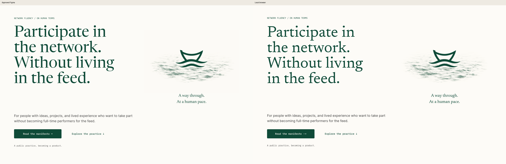
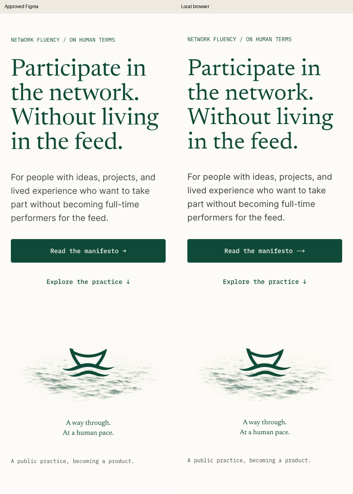

# Independent local browser review — 4 September 2026

**Verdict: approve the implementation's visual result at the tested widths. No blocking visual issue found.**

I inspected the production build served at `http://127.0.0.1:8769/` in the separate `afi-designer` browser session. I did not modify application code or Figma and did not use the release agent's browser session or test conclusions as evidence.

1. **Desktop, 1440 × 1000 — passes.** The vessel, ink surface, caption, headline, supporting copy, and actions closely reproduce the approved Figma composition. The water remains delicate and integrated with the unchanged mark. Type is clear; minor browser font-metric differences do not disturb the hierarchy. [Desktop capture](19-local-desktop-rest.png), [full page](20-local-desktop-full.png).
2. **Mobile, 390 × 844 — passes.** The headline retains its intended four lines, actions remain comfortably sized, and the water is recognisable at its actual mobile width. Document width equals viewport width at 390px; a DOM bounds check found no horizontal overflow. The same check passed at 1440px. [Mobile full page](21-local-mobile-full.png), [hero crop](local-mobile-crop-1.png).
3. **Actual opening — passes visual sequence check.** I replayed the local opening and captured arrivals, compressed text overlapping the emerging water, the entering vessel, and the settled result. Copy and actions remain visually stationary. The observed transition conveys the approved noise-to-ocean idea. Capture times are approximate, not a timing certification. [Arrivals](27-local-arrivals-top.png), [transformation](30-local-transform.png), [vessel entering](31-local-transform-later.png), [settled](29-local-settle-top.png). The initial recording did not capture the transition reliably and was excluded from this finding.
4. **Supporting sections and footer — passes.** Inspected full-page captures at legible crop sizes, then scrolled to and captured the actual mobile footer. No visible text collisions, clipping, blank image placeholders, broken section backgrounds, or horizontal overflow appeared. Browser error output was empty. [Desktop supporting sections](local-desktop-crop-2.png), [mobile supporting sections](local-mobile-crop-3.png), [mobile footer](23-local-mobile-footer.png).

Two optional mobile fidelity refinements remain: the attention choices retain slashes and wrap over two lines instead of Figma's three separate lines; “You decide what crosses” wraps over two lines instead of one. Both remain readable and balanced. Neither warrants blocking this release on visual grounds. See [attention choices](local-mobile-crop-3.png) and [human line](local-mobile-crop-4.png).

**Limits:** this review covers the local homepage's visible result and sampled opening. It does not prove the public deployment, precise frame timing, device performance, all breakpoints, 200% zoom, route behavior, keyboard/focus handling, reduced-motion behavior, session rules, or screen-reader accessibility. Those release checks are separate. The manifesto and made-with reading bodies were outside this focused review.
