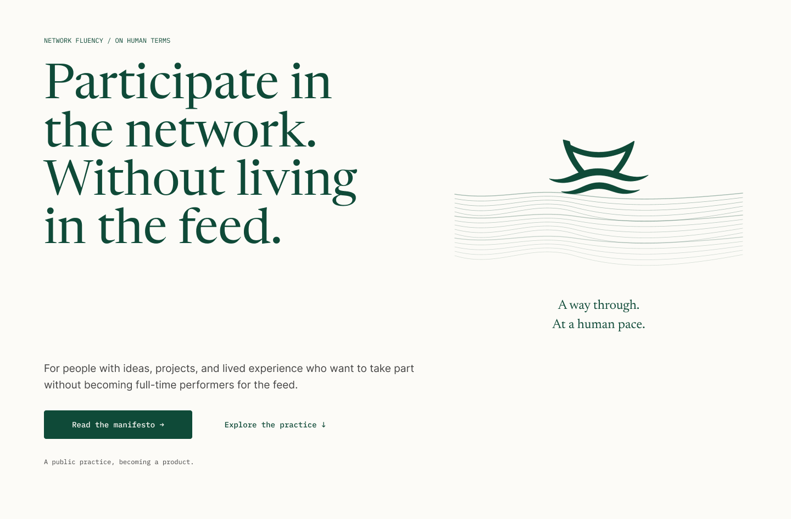
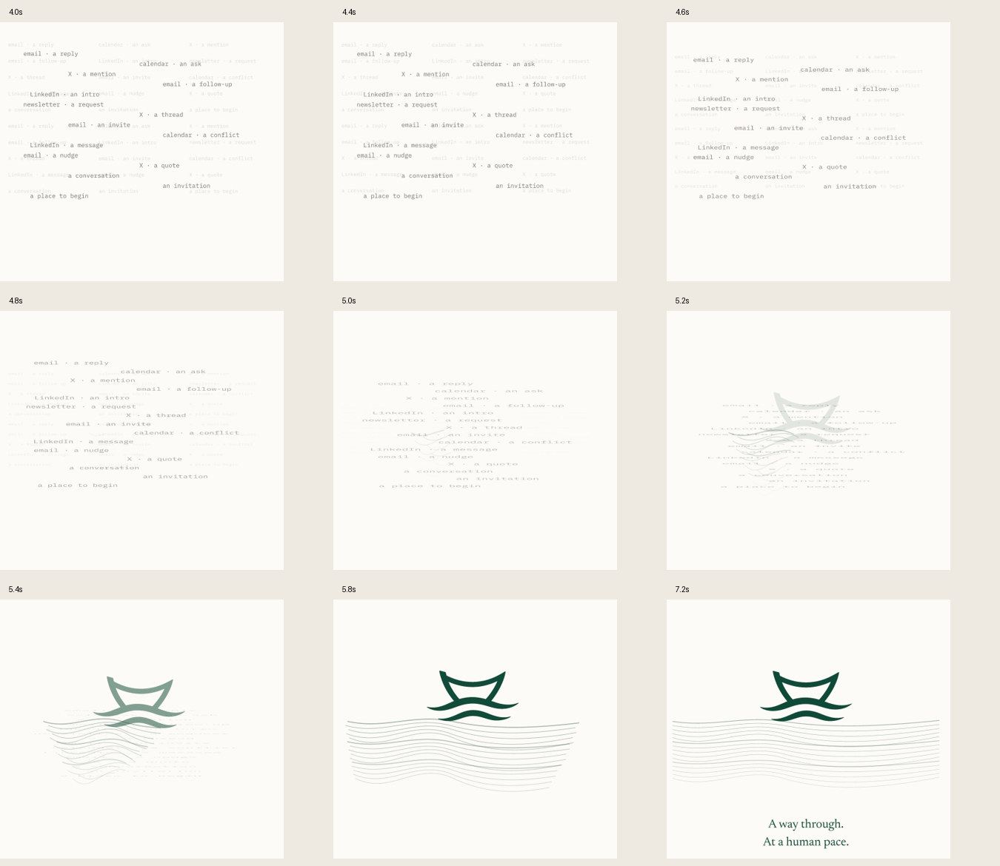
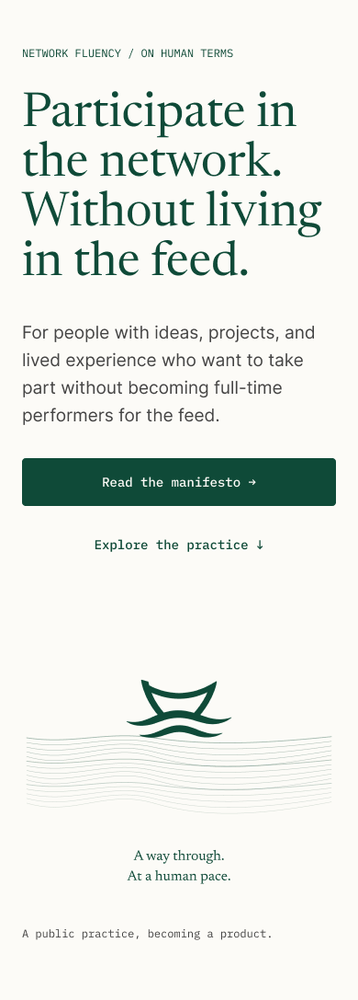

# Independent design review — 4 September 2026

**Verdict: approve with minor changes.** The ocean direction answers the brief and deserves to proceed as a design. The actual animation shows notification fragments gathering, compressing downward, and giving way to widening currents. The selected vessel rises into that field, makes a small settling movement, and comes to rest. The composition feels considered and consistent with a product about participation at a human pace.

This is an independent review of the existing Figma design, not implementation approval. I made no changes to Figma or application code and did not consult the author's review or previous QA conclusions.

## Fresh evidence and review steps

1. **Desktop opening — strong.** Captured hero `12:36` at its native 1440 × 946 size and full home `12:2` at 1440 × 4803. The headline has a clear silhouette, the mark remains recognisable, and the restrained forest/paper palette works. Supporting copy and actions are readable. See [desktop hero](01-desktop-hero.png) and [full page](03-desktop-full.png).
2. **Actual motion — convincing, with a subtle handoff.** Independently exported timeline `42:2` at 1200px wide, 10fps, and sampled the arrival, hold, transition, and settle. The timeline is 8.4 seconds; the movement settles at 7.2 seconds and the remaining time holds that composition. The encoded MP4 is 8.5 seconds including its endpoint frame. See [fresh MP4](05-timeline.mp4), [4.0s](motion-4.0s.png), [5.2s](motion-5.2s.png), and the transition sheet below.
3. **Mobile opening — readable, with a visibility tradeoff.** Captured hero `12:52` at 390 × 1087 and full home `12:3` at 390 × 6575, then inspected native-width crops. The headline, copy, and stacked 52px actions remain clear. The static ocean avoids forcing a seven-second sequence on mobile, but appears well below the initial viewport. See [mobile hero](02-mobile-hero.png) and [full page](04-mobile-full.png).
4. **Brand and comparison — consistent.** Compared the mark directly with the selected transparent master and read the current brand README. The open vessel and its two broad currents are preserved; no literal nautical decoration has been added. Inspected the [current public landing page](https://agentsforintroverts.com/) and saved a [fresh reference screenshot](07-public-current-reference.png). The current page's scattered text remains a recognisable visual ancestor. The new illustration gives that texture a clearer destination.

## Prioritised recommendations

**1. Make the specified “Skip motion” control part of the animated hero specimen. — Minor design handoff gap.**

The motion guide `25:24` specifies a visible control of at least 44px during the opening. The exported hero `42:2` has no visible skip control, and a fresh inspection found no descendant text for skip or pause. Place it in the actual animated composition and include its focused state, with the calm destination defined. That lets the next implementer see its placement and relationship to the illustration. This is a mismatch between the design specification and its specimen; it does not establish a broken website control because the redesign is not implemented.

**2. Keep a few leading fragments legible for longer as the water forms. — Subjective motion clarity improvement.**

At 4.8–5.4 seconds the text stretches and flattens while separate wave paths emerge. The intended continuity is visible, but this is also the faintest part of the sequence. At ordinary page scale, a viewer may register “text fades, ocean appears” more readily than “this text becomes the ocean.” The lead fragment `42:123`, for example, falls from 0.72 opacity at 4.35s to 0.32 at 5.15s while scaling vertically toward 0.035. Keep three or four leading fragments darker through roughly 5.2s and align their final short strokes with corresponding currents before fading them. Preserve the current duration and quiet ambient layer. A full morph of every glyph is unnecessary.

**3. Spend less of the opening on vertical empty space. — Layout tradeoff, especially on mobile.**

The mobile navigation is 156px tall. The ocean instance `39:211` begins at page y=806; its visible vessel begins lower still, around y=896 in the screenshot. A 390 × 844 viewport therefore gets the reading actions but no meaningful ocean scene. Keeping actions first is a sound choice, but the revised motif deserves earlier visibility. Reduce the mobile header height and the illustration's internal top blank area, retaining the 52px action targets and readable type. On desktop, the action row begins at page y=832, so it also falls below an 800px-high viewport. Consider placing the supporting copy/actions directly beneath the headline inside its column instead of waiting for the full 510px illustration row to end. These are refinements to the existing composition, not a reason to shrink the headline indiscriminately.

## What should stay

- **The selected mark and palette.** The vessel is visually faithful to the source asset, and the hero background is the specified `#FDFBF7`. Forest `#0F4A38` anchors type, mark, and actions.
- **The restrained settling motion.** The ship `42:138` moves from +24px to −5px to rest, with a small −2° / +1° / 0° tilt. Together with the broad currents already in the mark, it feels supported by the water. It does not need sails, a wake, stronger rocking, or an idle loop.
- **The separation of reading and decoration.** Headline, supporting copy, and actions stay visually still throughout the exported sequence. The calm result remains useful without motion.
- **The overall editorial hierarchy.** Large serif statements, quieter sans-serif explanation, and compact monospace labels form a coherent system. The forest section creates a useful change of pace in the longer page. No visible clipping or text collisions appeared in the inspected desktop/mobile renders.

## Limits

The review proves the rendered Figma composition and sampled timeline, not runtime interaction. I read the guide's reduced-motion, repeat-visit, no-script, decorative-image, and focus intentions; none was exercised in the redesigned website. Keyboard order, actual skip behavior, reduced-motion preferences, screen-reader output, reflow at 200% zoom, intermediate widths, device performance, links, and session handling remain unverified. The 10fps export is adequate for sequence and timing assessment, not a smoothness/performance certification.

The public reference was observed live at rest. Its earlier 7.2-second timing and 4.05–4.35s hold were checked in the provided reference source (`src/components/HeroAnimation.tsx` and `src/app/globals.css`); those local files were not proven identical to the deployed bundle. No prior audit or memory-derived result is used as review evidence.
