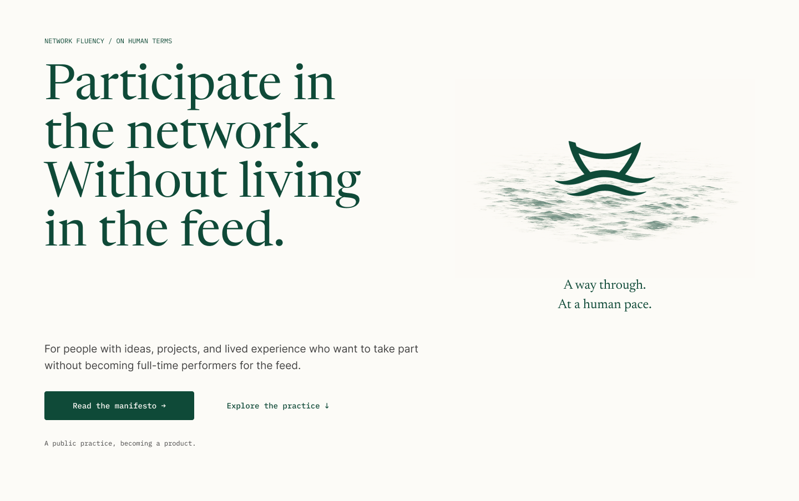
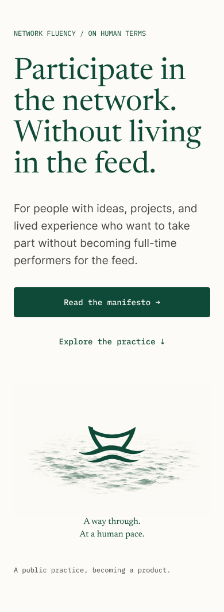
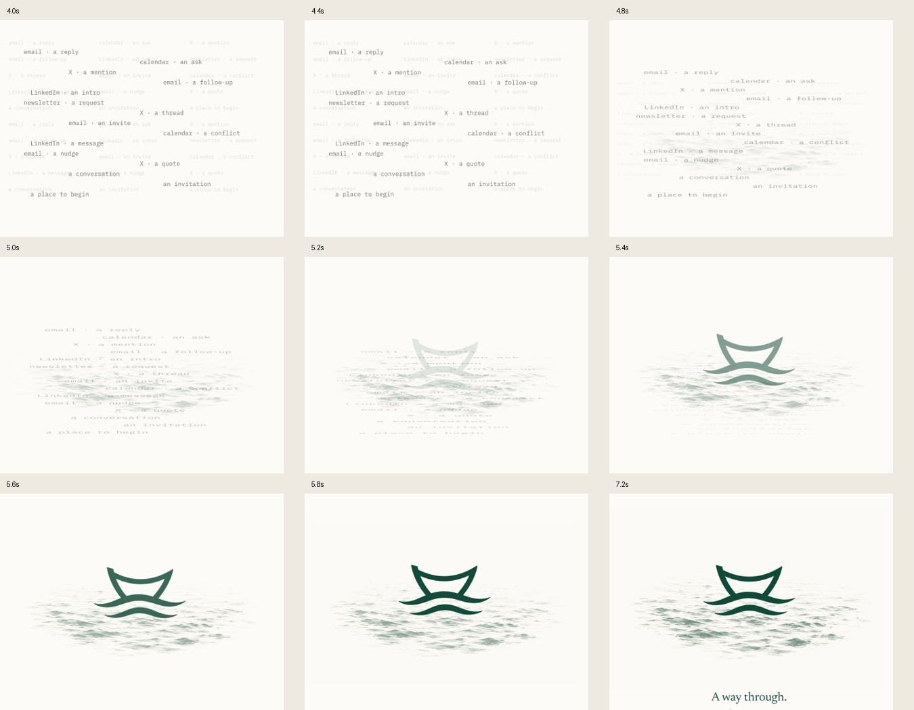
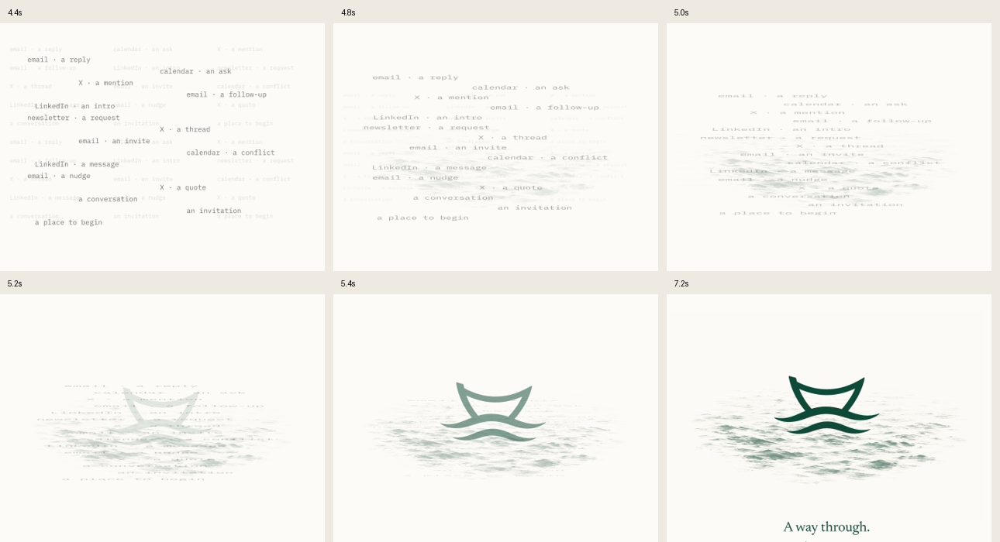

# Independent re-review: ink-water revision

**Verdict: approve this revised water treatment.** The previous approval is superseded following the user's rejection of the earlier water. This verdict applies to the new illustration and its visual integration in the Figma opening; it is not approval of website implementation or accessibility.

**Final check:** the optional fragment-alignment refinement described below was subsequently addressed and independently re-exported. The final verdict remains approve; see the addendum and [final transition evidence](17-v2-final-transition.png).

The irregular ink surface looks substantially more sophisticated than the repeated fine curves it replaces. Broken highlights, uneven density, and soft edges give it the character of an editorial engraving. In my judgment, it fits the large serif typography and warm paper background without looking like a generic technology animation.

## What I inspected

1. **Isolated study, node `61:4` — improved after contact revision.** I captured both the initial ink treatment and its revised placement. The first version looked like a solid logo floating above a separate pale water image. Moving the water upward and reducing its density resolved most of that separation. The surface now passes behind and immediately beneath the mark's lower current. See [initial study](08-ink-water-study.png) and [contact revision](10-ink-water-contact-revision.png).
2. **Actual desktop hero, node `12:36` — strong.** Fresh independent capture at 1440 × 904. The original mark remains dominant, while the water supplies atmosphere and physical support. The lifted caption closes the former empty gap. The texture has enough detail to reward attention without competing with the headline. See [desktop](12-v2-desktop-hero.png).
3. **Actual mobile hero, node `12:52` — holds up.** Fresh capture at 390px wide. Fine ripples soften, but the broad light/dark pattern still reads as water. The vessel stays crisp. I do not see a need to increase texture density for mobile. The ocean remains lower in the reading sequence; that is a placement tradeoff inherited from the page, not a defect introduced by this water treatment. See [mobile](13-v2-mobile-hero.png).
4. **Actual transition, node `42:2` — coherent, with optional polish.** I independently exported the current timeline at 1200px wide and 10fps, then extracted frames from 4.0–7.2 seconds. I also inspected the supplied desktop/mobile renders and the 5.2-second frame; the verdict uses my own fresh captures and timeline samples. See [independent MP4](14-v2-independent-timeline.mp4) and [transition sheet](15-v2-transition-contact-sheet.png).

## Remaining observations

**No remaining material visual-quality issue in this specific water revision.** The contrast between the graphic mark and the engraved surface now feels deliberate. I would preserve the existing opacity, the unchanged mark, and the quiet resting state. Adding more waves, continuous bobbing, a hard horizon, or nautical decoration would weaken its restraint.

**Optional motion refinement:** at approximately 5.0–5.4 seconds, some flattened text fragments extend beneath the raised water plane. The sequence still communicates noise compressing into water, but the final words visibly dissolve below the surface instead of landing within it. If polishing further, move those fragments' final vertical destinations into the foreground ripple band while retaining the accepted timing. This is a perceptual continuity refinement, not grounds for replacing the water or withholding approval of its visual direction. Evidence: [5.0 seconds](v2-motion-5.0s.png), [5.2 seconds](v2-motion-5.2s.png), and [5.4 seconds](v2-motion-5.4s.png).

The water's vignette still makes this an illustrated scene rather than a full-width ocean landscape. That is a stylistic choice, and I think it suits this layout. It gives the text breathing room and keeps the brand symbol intact.

## Addendum: final fragment alignment

After the final fragment destinations were lifted, I inspected the supplied 5.2-second frame, then independently exported the current Figma timeline again and sampled 4.4, 4.8, 5.0, 5.2, 5.4, and 7.2 seconds. The compressed fragments now overlap more closely with the water's foreground before disappearing. The trailing words no longer form such a distinct separate band below the illustrated surface. This sufficiently addresses the optional continuity note; I would stop iterating this particular detail.

**Final verdict: approve the revised water and its visual handoff.** I see no remaining material visual issue in this focused revision. The mark stays intact, the water reads at mobile size, and the final state remains restrained. This does not certify production behavior or supersede the user's own aesthetic decision.

Final evidence: [independent final MP4](16-v2-final-independent-timeline.mp4), [5.2-second final frame](v2-final-5.2s.png), and [final transition sheet](17-v2-final-transition.png). The earlier MP4 and transition sheet remain in this folder as intermediate evidence.

## Limits

This is a visual re-review based on fresh Figma screenshots and sampled exported motion. No Figma or application mutations were made. I did not read or rely on author QA conclusions. Frame sampling supports sequence, composition, and transition assessment; it is not device performance or smoothness certification. Runtime keyboard controls, reduced-motion behavior, repeat visits, no-script fallback, responsive reflow, and assistive-technology behavior remain unverified. The earlier review's broader implementation/handoff observations were not re-audited in this focused pass.
